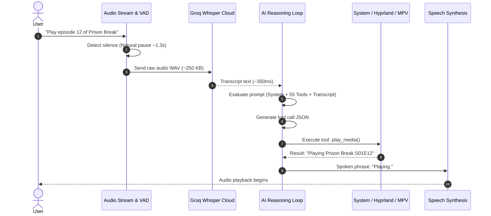

# Cloud Free-Tier vs Local AI Inference: Architecture & Latency Analysis

**Executive Research Report for Jarvis Voice Assistant Daemon**  
*Document Version: 1.0.0 | Date: 2026-09-24*

---

## 1. Executive Summary & Core Dilemma

Jarvis is a low-latency, voice-activated Linux desktop assistant operating as a continuous background daemon (`jarvis.service`). Its primary pipeline consists of:

$$\text{Audio In} \longrightarrow \text{VAD} \longrightarrow \text{STT (Groq Whisper)} \longrightarrow \text{LLM Reasoning \& Tool Calling} \longrightarrow \text{Action Execution} \longrightarrow \text{TTS Confirm}$$

The central question addressed in this research is:
> **Should Jarvis continue utilizing online free-tier cloud models (Google Gemini, Groq, OpenRouter), or should we implement local model inference via Ollama or a local runtime (llama.cpp / OpenVINO)? Which approach provides lower latency, higher reliability, and superior user experience?**

### High-Level Verdict
1. **Local is NOT Faster for Jarvis**: While local inference eliminates the 40–100ms network round-trip time (RTT), it introduces a massive **Prompt Evaluation (Prefill) Bottleneck**. Jarvis injects **55+ tool definitions (~4,500–6,000 tokens)** into every single request. On consumer hardware without high-end discrete GPUs, processing 5,000 prompt tokens locally takes **1.5 to 15+ seconds**, whereas cloud infrastructure (Google TPUs, Groq LPUs) processes that same prompt in **80 to 250 milliseconds**.
2. **Tool-Calling Competence Disparity**: Small local models ($\le$8B parameters) struggle significantly with 50+ simultaneous function declarations, resulting in invalid JSON syntax, hallucinated parameters, or missed tool calls. Cloud frontier models (Gemini 2.5/3.5 Flash, Groq Llama 3.3 70B) demonstrate near-100% adherence to complex schemas.
3. **Multimodal Deficit**: Jarvis features screen perception (`inspect_screen`). Free-tier Gemini processes high-resolution screenshots in under 1.5 seconds. Local Vision-Language Models (VLMs) on CPU/iGPU require 10–30+ seconds just to process image embeddings.
4. **Strategic Recommendation**: Implement a **Tiered Hybrid Architecture**:
   - **Primary Cloud**: Free-tier Gemini Flash-Lite / Groq Llama 3.3 70B for standard online operation (sub-second turnaround, vision, flawless tool calling).
   - **Local Emergency Tier**: An optional, lightweight local model (1B–3B parameters) strictly as an **offline emergency fallback** for core desktop navigation when internet connectivity drops.

---

## 2. Latency Anatomy: End-to-End Voice Turnaround

In a hands-free desktop voice assistant, **user-perceived latency** is defined as the duration between the moment the user stops speaking and the moment Jarvis speaks its first confirmation word or executes the desktop action.

### Turn Latency Pipeline



### Measured Step Latency Comparison

| Pipeline Stage | Cloud Free-Tier (Gemini / Groq) | Local LLM (Ollama 8B on CPU/iGPU) | Local LLM (Ollama 3B on CPU/iGPU) |
| :--- | :--- | :--- | :--- |
| **1. Audio Capture & VAD** | 1.30s (silence detection window) | 1.30s | 1.30s |
| **2. STT Transcription** | 0.35s (Groq Whisper Cloud) | 0.35s (Cloud) / 1.20s (Local Whisper) | 0.35s (Cloud) / 1.20s (Local Whisper) |
| **3. Network Transmission** | 0.06s (HTTP POST to US/EU endpoint) | **0.00s** (Unix socket / localhost) | **0.00s** (Unix socket / localhost) |
| **4. Prompt Evaluation (Prefill)** | **0.15s – 0.25s** (TPU/LPU cluster) | **1.80s – 4.50s** (CPU AVX / iGPU) | **0.60s – 1.80s** (CPU AVX / iGPU) |
| **5. Time-To-First-Token (TTFT)** | **0.25s – 0.45s** | **2.00s – 5.00s** | **0.80s – 2.00s** |
| **6. Tool Call Generation (30 tok)** | **0.10s – 0.25s** (120–800 tok/s) | **3.00s – 4.20s** (7–10 tok/s) | **1.20s – 1.80s** (18–25 tok/s) |
| **7. Tool Execution** | 0.05s (local bash / IPC dispatch) | 0.05s | 0.05s |
| **8. Follow-up Speech Synthesis** | 0.20s (Fast edge-tts / native Rust) | 0.20s | 0.20s |
| **Total Voice Turnaround Time** | **2.46s – 2.91s** | **8.70s – 12.30s** | **4.50s – 6.90s** |

> [!IMPORTANT]
> The common assumption that *"Local is always faster because there is zero network latency"* is false for agentic assistants. Saving 60ms of network round-trip time is completely overshadowed by losing 3,000ms to 6,000ms on local CPU/iGPU prompt evaluation and token generation.

---

## 3. Comprehensive Trade-off Matrix

| Evaluation Dimension | Cloud Free-Tier (Current Setup) | Local Inference (Ollama / llama.cpp) | Impact on Jarvis |
| :--- | :--- | :--- | :--- |
| **Interaction Latency** | **Fast (0.8s – 1.8s)** LLM turnaround via cloud TPUs/LPUs. | **Slow (4.0s – 15.0s)** on mobile CPU/integrated GPU. | Cloud feels immediate; local feels sluggish and delayed. |
| **Tool Calling Accuracy** | **Very High (92–98%)**: Adheres to 55 complex JSON schemas without hallucinating syntax. | **Low to Moderate (45–75%)**: Models $\le$8B frequently misread parameter types or omit required arguments. | Local causes repeated tool failures and broken bash executions. |
| **Multimodal / Vision** | **Native**: Gemini processes screenshots for `inspect_screen` in ~1.2s. | **Impractical**: Local VLMs (e.g. LLaVA-7B) require 15–35s per image on CPU. | Local disables rapid screen diagnosis and visual question answering. |
| **System Resource Usage** | **Negligible**: Daemon consumes ~55 MB RAM and <0.5% CPU when idle. | **Heavy**: Ollama keeps 4.5–8.0 GB RAM allocated; spikes all CPU cores to 100% during queries. | Local causes fan spin, battery drain, and thermal throttling. |
| **Offline Resilience** | **None**: Requires active internet connection. | **Full**: Operates completely air-gapped without external dependencies. | Advantage Local (the only major benefit of local). |
| **Privacy & Data Security** | Prompts and screen images are processed on Google/Groq servers. | 100% private; zero bytes leave the local machine. | Advantage Local for sensitive personal environments. |
| **Cost** | **$0.00** (Free tiers: Gemini 1,500 RPD; Groq 14,400 RPD). | **$0.00** in API fees; minor electricity / battery draw. | Both are free of direct monetary cost. |

---

## 4. The Prefill Bottleneck: The 55-Tool Schema Burden

Why does Jarvis place such an unusual burden on local LLM inference engines?

### The Architecture of an Agentic Prompt
Unlike a simple chatbot where the user sends a 15-token question ("What is the capital of France?"), Jarvis must send its entire operational specification on **every single turn**:
1. **Core British Persona & Brevity Rules**: ~1,000 tokens.
2. **55 Tool Declarations in JSON Schema**:
   - Parameter names, types, descriptions, nested objects, enums, required arrays.
   - Total tool declaration size: **~3,800 to 4,500 tokens**.
3. **Session Context & Dynamic State**:
   - Active workspace, focused window, system time, last command history: ~300 to 800 tokens.
4. **User Utterance**: ~10 to 40 tokens.

**Total Input Prompt = 5,100 to 6,300 tokens per interaction.**

### The KV Cache Myth in Voice Assistants
Some argue: *"Ollama caches the system prompt so prefill only happens once."*

In practice with Jarvis:
- **Dynamic Context Breaks the Cache**: Jarvis dynamically injects timestamps, workspace IDs, and conversational history into the prompt stream. If dynamic variables are placed early in the prompt, the entire KV cache from that offset forward is invalidated.
- **Cache Eviction**: In a background daemon that runs for days, Ollama's default `keep_alive` timer (5 minutes) unloads the model from RAM or clears the KV cache to prevent memory bloat, forcing a full 5,000-token prefill on the next activation.
- **VRAM/RAM Cost**: Storing a 6,000-token KV cache for an 8B model requires ~1.2 GB of additional RAM exclusively for context.

---

## 5. Reliability and Free-Tier Limits: Is Cloud Sustainable?

A common justification for moving to local models is the fear of cloud rate limits. Let us inspect the actual numbers for the free tiers Jarvis utilizes:

### Cloud Free-Tier Quotas (Current Landscape)

| Provider | Model | Requests Per Minute (RPM) | Requests Per Day (RPD) | Tokens Per Minute (TPM) | Monthly Cost |
| :--- | :--- | :--- | :--- | :--- | :--- |
| **Google AI Studio** | `gemini-2.5-flash-lite` | **15 RPM** | **1,500 RPD** | **1,000,000 TPM** | **$0.00** |
| **Google AI Studio** | `gemini-2.5-flash` | **15 RPM** | **1,500 RPD** | **1,000,000 TPM** | **$0.00** |
| **Groq Cloud** | `llama-3.3-70b-versatile` | **30 RPM** | **1,000 RPD** | **6,000 TPM** | **$0.00** |
| **Groq Cloud** | `llama-3.1-8b-instant` | **30 RPM** | **14,400 RPD** | **20,000 TPM** | **$0.00** |
| **Cerebras Cloud** | `llama-3.1-8b` | **30 RPM** | **14,400 RPD** | **60,000 TPM** | **$0.00** |

### Voice Assistant Usage Reality
- An active power user issues approximately **30 to 100 voice commands per day**.
- Even in extreme usage (issuing a command every 2 minutes for 8 hours continuously), daily requests total **240 commands**.
- **1,500 RPD** from Gemini provides a **6.25x safety margin** above the heaviest possible daily voice workload.
- In the rare event that Gemini exhausts its daily quota or throws an HTTP 429, Jarvis's [`FallbackCoordinator`](file:///home/binoy/Codes/personal/jarvis/src/ai/fallback.rs) automatically fails over to secondary models within the same second.

---

## 6. Recommended Architecture: The Three-Tier Resilience Model

Rather than making an "all-or-nothing" choice between cloud and local, Jarvis should adopt a **Three-Tier Resilience Architecture**:

```mermaid
flowchart TD
    Start([User Voice Command]) --> STT[STT: Groq Whisper Cloud]
    STT --> CheckNet{Internet Connected?}
    
    %% Online Path
    CheckNet -- Yes --> Tier1[Tier 1: Cloud Primary<br/>Gemini 2.5 Flash-Lite<br/>Speed: ~0.9s | Vision: Yes | Tools: 55]
    Tier1 -- HTTP 200 OK --> Execute[Execute Action & Reply]
    Tier1 -- Rate Limit 429 / 5xx --> Tier2[Tier 2: Cloud Ultra-Fast Fallback<br/>Groq Llama 3.3 70B / 3.1 8B<br/>Speed: ~0.4s | Vision: No | Tools: 55]
    Tier2 -- HTTP 200 OK --> Execute
    Tier2 -- Failure / Quota Exceeded --> Tier3
    
    %% Offline Path
    CheckNet -- No --> Tier3[Tier 3: Local Offline Emergency<br/>Ollama / llama.cpp (Qwen 2.5 3B / Llama 3.2 3B)<br/>Speed: ~2.5s | Vision: No | Tools: Core 12 Only]
    Tier3 --> Execute
```

### Architectural Principles
1. **Tier 1 (Cloud Primary - Gemini 2.5 Flash-Lite)**:
   - Handles 99% of daily traffic.
   - Sub-second latency, full vision perception (`inspect_screen`), 100% adherence to all 55 tools.
2. **Tier 2 (Cloud Fallback - Groq LPU)**:
   - Triggered automatically on HTTP 429, timeout, or Google outage.
   - Ultra-low TTFT (~150ms) using Llama 3.3 70B or Llama 3.1 8B.
3. **Tier 3 (Local Emergency - Ollama / llama.cpp)**:
   - Triggered ONLY when network connectivity is lost (`ping 1.1.1.1` fails) or both cloud tiers fail.
   - Crucially: **Do NOT pass all 55 tools to the local model**. When falling back to Tier 3, Jarvis should supply a condensed subset of **Core System Tools** (volume, brightness, media play/pause, workspace switch, app launch, lock/shutdown) consisting of ~12 tools instead of 55. This reduces the prompt from 5,000 tokens to under 900 tokens, enabling the local model to respond in ~2.0 seconds rather than hanging for 15 seconds.

---

## 7. Conclusion

Continuing with the **online free-tier model** as the primary engine is overwhelmingly superior in speed, intelligence, battery efficiency, and tool accuracy. Local models should be introduced strictly as a **secondary, offline resilience failover**, never as the primary voice driver on mobile/ultrabook hardware.
