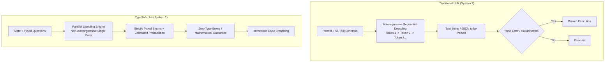

# Jev & System One Models: Technical Analysis & Feasibility for Jarvis

**Evaluation of TypeSafe AI's "Jev" for Real-Time Linux Desktop Voice Automation**  
*Document: `docs/JEV_ANALYSIS.md` | Date: 2026-09-24 | Reference: [TypeSafe AI Blog](https://typesafe.ai/blog/introducing-system-one-models-and-jev)*

---

## 1. Executive Summary

On September 15, 2026, **TypeSafe AI** (founded by former OpenAI ChatGPT researcher Diogo Almeida) introduced **Jev**, the world's first **"System One Model"**. 

Drawing inspiration from Daniel Kahneman's cognitive framework in *Thinking, Fast and Slow*:
- **System 2 (Traditional LLMs - GPT-4o, Gemini, Claude)**: Slow, deliberate, sequential autoregressive token generation. Flexible and creative, but prone to hallucinations, schema violations, high latency (1s–10s+), and high cost.
- **System 1 (Jev)**: Fast, intuitive, automatic judgment. **It completely gives up freeform string generation**. Instead, it takes program state and a set of predefined, typed questions, evaluating all decisions **in parallel** in **70ms to 500ms** with mathematical type-safety and calibrated confidence scores.

### The Bottom Line for Jarvis
1. **Can Jev Replace Gemini / Groq as Jarvis's Primary Reasoning Engine?**  
   **NO.** Jev cannot generate conversational spoken text, cannot synthesize markdown research reports, and cannot extract open-ended string arguments (e.g., reminder messages, YouTube search queries, project descriptions).
2. **Can Jev Be Used in Jarvis?**  
   **YES — as a transformative 70ms "Fast-Path Intent Router"**. Integrating Jev into Jarvis's frontend pipeline can classify user voice intent in **under 100ms**. Common fixed-action commands (play/pause media, lock screen, mute volume, switch workspaces) can bypass the heavy generative LLM entirely, dropping voice execution latency from **~1.2 seconds down to ~250 milliseconds**.

---

## 2. Technical Profile: How Jev Works

### Architectural Comparison: LLMs vs. System One (Jev)



### Key Technical Specifications

| Feature | Existing LLMs (Gemini, Claude, GPT) | TypeSafe Jev (System One) |
| :--- | :--- | :--- |
| **Optimization Method** | RLHF / RLVR (Optimized for human conversational preference) | **RLCD (Reinforcement Learning for Calibrated Decisions)** |
| **Sampling Mechanism** | Sequential (one token at a time, each conditioned on the last) | **Parallel Sampling** (generates all outputs in a single hardware-aware pass) |
| **End-to-End Latency** | 800ms – 5,000ms+ | **70ms – 500ms** (up to 40x–100x faster) |
| **Output Type** | Strings / Generated Text (requires parsing, risk of hallucination) | **Typed Structured Values** (`Choice`, `Score`, `Noul`) with probabilities |
| **Confidence Scoring** | Inconsistent or uncalibrated | **Calibrated Confidence** (higher confidence mathematically correlates with accuracy) |
| **Pricing** | $0.15 to $10.00 / MTok input; output tokens ~5x more expensive | **$0.042 / MTok input** ($42 / billion); **Output tokens are FREE** |
| **Failure Mode** | Hallucinations, syntax invalidity, malformed JSON arguments | Misclassification (reported with low confidence); **Zero schema/type errors** |

### The Three TypeSafe AI Primitives

Jev operates exclusively through three composable primitive question types:

1. **`Choice`**: Selects a discrete key from a predefined dictionary with per-option probabilities and confidence score.
2. **`Score`**: Assigns a discrete rating on a predefined rubric (e.g., 0 to 4).
3. **`Noul`**: A true/false epistemic judgment returning a calibrated 0.0 to 1.0 probability.

All questions are evaluated **in parallel** against the state in a single HTTP request. Adding 10 questions to a query barely changes the execution time.

---

## 3. Feasibility Analysis for Jarvis

### Where Jev CANNOT Be Used in Jarvis

| Jarvis Feature | Why Jev Is Incompatible | What Must Be Used Instead |
| :--- | :--- | :--- |
| **Spoken Spoken Confirmation** | Jev does not emit words. It cannot reply *"Playing Prison Break Season 1 Episode 12 in fullscreen, sir."* | Generative LLM (Gemini Flash-Lite / Groq) |
| **Arbitrary Parameter Extraction** | Tools like `set_reminder(message, minutes)`, `open_youtube(query)`, or `create_project(name, description)` require open-ended string arguments. Jev only supports fixed choices. | Generative LLM with Function Calling |
| **Deep Research Generation** | Jarvis synthesizes multi-page Markdown reports for the Neovim popup (`display_research_in_neovim`). Jev cannot write prose or code. | Frontier Generative LLM |
| **Multimodal Screen Analysis** | `inspect_screen` sends desktop screenshots. Jev is currently an unstructured text/state model without image support. | Multimodal Gemini Flash |

---

### Where Jev CAN Transform Jarvis (High-Value Applications)

While Jev cannot be the *sole* AI in Jarvis, it is an ideal **Co-Processor for Real-Time Desktop Automation**:

#### 1. The 70ms "Fast-Path" Intent Gatekeeper
Over 60% of daily voice commands are simple, fixed-target system actions:
- *"Pause playback"*, *"Next track"*, *"Mute volume"*, *"Turn brightness up"*, *"Switch to workspace 2"*, *"Lock my screen"*, *"Check battery level"*.

Currently, every one of these simple commands is piped through Groq STT $\to$ Gemini Flash-Lite $\to$ 55 Tool Declarations $\to$ LLM Tool Call $\to$ Execution (**~1.2 seconds total turnaround**).

**With Jev as a Fast-Path Router**:

```mermaid
sequenceDiagram
    autonumber
    User->>Jarvis: "Hey Jarvis, pause the music"
    Jarvis->>STT: Transcribe (Groq Whisper ~300ms)
    STT-->>Jarvis: "pause the music"
    
    rect rgb(20, 40, 20)
    Note over Jarvis,Jev: Fast-Path Evaluation (<100ms)
    Jarvis->>Jev: Evaluate intent Choice against fixed desktop tools
    Jev-->>Jarvis: action: "media_play_pause", confidence: 0.98
    end
    
    Jarvis->>Desktop: Execute media_play_pause()
    Jarvis->>TTS: Speak "Paused."
    Note over User,TTS: Total turnaround: ~450ms (Instantaneous!)
```


If Jev's output is `action: "needs_complex_reasoning"` or confidence is below 0.80, Jarvis seamlessly forwards the request to the full Gemini reasoning loop.

#### 2. Deterministic Session Dismissal & Farewell Detection
Currently, Jarvis checks user transcripts against a static list of regular expressions in [`src/ai/agent.rs`](file:///home/binoy/Codes/personal/jarvis/src/ai/agent.rs#L91-L100):
```rust
static EXIT_PATTERNS: LazyLock<Vec<Regex>> = ...
```
Regex frequently fails when users say colloquial farewells (*"I think that'll do it for now"*, *"All good mate, cheers"*). Passing this to a full LLM takes 1 second. Jev can evaluate a `Noul` question in **70ms**:
```json
{
  "is_dismissal": {
    "type": "noul",
    "instructions": "The user is expressing that they are finished or dismissing the voice assistant."
  }
}
```
If `noul >= 0.85`, the session terminates immediately without invoking Gemini.

#### 3. High-Stakes Action Confirmation Guardrail
For dangerous commands (shutdown, reboot, logout), Jarvis prompts the user for confirmation. Jev provides mathematically guaranteed schema outputs for user confirmation:
```json
{
  "confirmation": {
    "type": "choice",
    "instructions": "Did the user confirm the high-risk action?",
    "criteria": {
      "affirmative": "Yes, proceed, confirm, do it",
      "negative": "No, cancel, stop, abort",
      "ambiguous": "Unclear or unrelated utterance"
    }
  }
}
```
Zero risk of an LLM hallucinating a confirmation or misunderstanding a cancellation.

---

## 4. Architectural Implementation Blueprint in Rust

Integrating Jev into the Jarvis Rust codebase requires adding a lightweight HTTP client in `src/ai/` that implements the TypeSafe System One API:

### 1. Request / Response Structs (`src/ai/jev.rs`)

```rust
use serde::{Deserialize, Serialize};
use std::collections::HashMap;

#[derive(Serialize)]
pub struct JevRequest<'a> {
    pub state: &'a str,
    pub model: &'a str, // "jev-latest"
    pub questions: HashMap<&'a str, JevQuestion<'a>>,
}

#[derive(Serialize)]
#[serde(tag = "type")]
pub enum JevQuestion<'a> {
    #[serde(rename = "choice")]
    Choice {
        instructions: &'a str,
        criteria: HashMap<&'a str, &'a str>,
    },
    #[serde(rename = "noul")]
    Noul {
        instructions: &'a str,
    },
    #[serde(rename = "score")]
    Score {
        instructions: &'a str,
        criteria: Vec<&'a str>,
    },
}

#[derive(Deserialize)]
pub struct JevResponse {
    pub answers: HashMap<String, JevAnswer>,
}

#[derive(Deserialize)]
pub struct JevAnswer {
    pub choice: Option<String>,
    pub score: Option<f32>,
    pub noul: Option<f32>,
    pub confidence: Option<f32>,
}
```

### 2. Fast-Path Router Integration (`src/cli/runner.rs`)

```rust
// In voice activation loop:
let transcript = stt.transcribe(&audio_wav).await?;

// Step 1: Query Jev Fast-Path (<100ms)
if let Some(action) = jev_client.fast_route(&transcript).await {
    if action.confidence > 0.85 {
        info!("Fast-path routed to: {}", action.command);
        execute_direct_action(&action.command, &tools).await?;
        tts.speak("Done.").await?;
        return Ok(());
    }
}

// Step 2: Fallback to full Gemini Reasoning Loop
agent.process_turn(&transcript).await?;
```

---

## 5. Cost & Commercial Considerations

- **Input Cost**: $0.042 / MTok ($0.000042 per 1,000 tokens). A 200-token user utterance + state costs **$0.0000084 per call**.
- **Output Cost**: **$0.00 (Free)**.
- **Daily Voice Cost**: 100 fast-path queries per day costs less than **$0.0008/day** (less than $0.03 per month).
- **Access Status**: Currently in **Early Access / Waitlist** (released Sep 15, 2026). Developers can request access at [console.typesafe.ai](https://console.typesafe.ai).

---

## 6. Definitive Conclusion & Recommendation

| Question | Answer |
| :--- | :--- |
| **Can we use Jev to replace our current model?** | **No.** Jev is not a chat/conversational model. It cannot generate prose, speak answers, or extract arbitrary text arguments. |
| **Can we use Jev to enhance Jarvis?** | **Yes, decisively.** Jev can serve as a **70ms Fast-Path Intent Router**, dropping simple command execution latency from ~1.2s to ~250ms with zero risk of hallucination. |
| **Immediate Actionable Step**: | 1. Sign up for early access at `https://console.typesafe.ai`.<br/>2. Keep Google Gemini Flash-Lite as the primary reasoning engine.<br/>3. When early access is granted, implement `JevRouter` as an optional pre-routing acceleration layer in Jarvis. |
